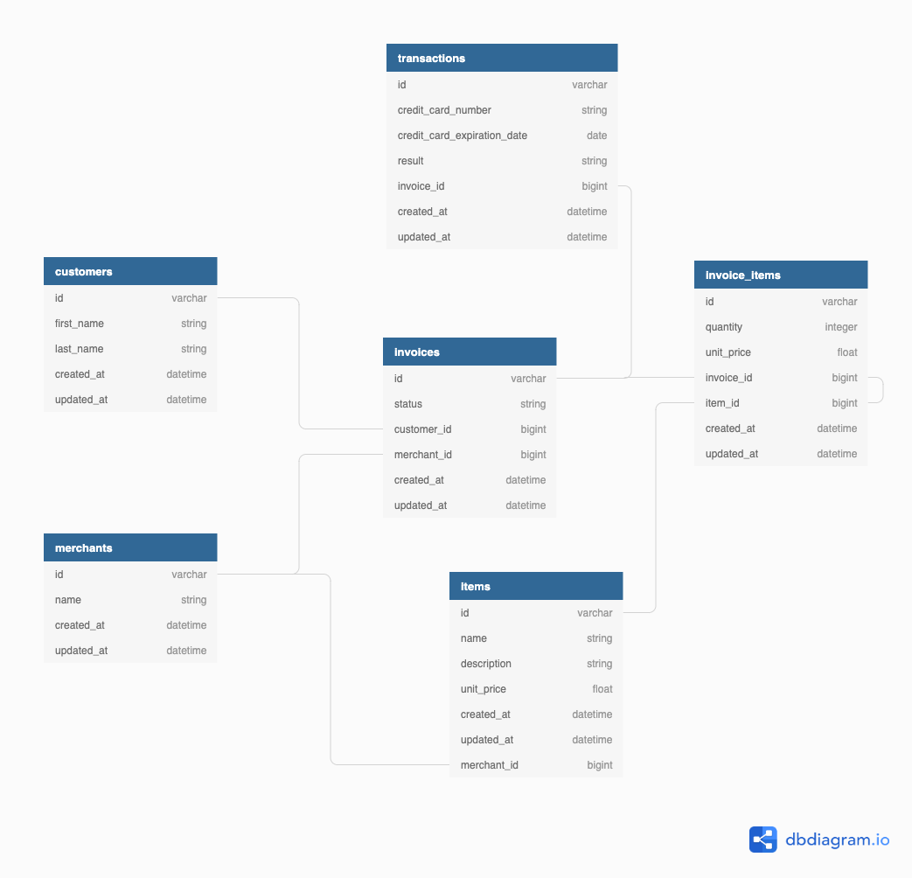

# Intro

This is a solo project for Mod 3 students. The complete set of directions can be found at https://backend.turing.io/module3/projects/rails_engine_modified.

 

## Instructions

First, clone the directory to a local repository:

`git clone https://github.com/linda-le1/rales-engine-api`

Then, navigate into the project from your terminal:

`cd rales_engine_api`

This project does make use of several gems (see details for more information below) that needs to be bundled:

`bundle install`

Get your database and tables created:

`rails db:create
rails db:migrate`

Run the rake import file to seed your database:

`rake import`

This should have created:
- 100 merchants
- 1000 customers
- 4843 invoices
- 2483 items
- 5595 transactions
- 21687 invoice items

Then run rspec to ensure all of the tests are passing.

## Gems Used

RSPEC gem was used for testing: https://github.com/rspec/rspec. 
Shoulda-Matchers were used in addition to the RSPEC testing suite: https://github.com/thoughtbot/shoulda-matchers. 
Netflix's fast JSON API gem was used to serialize the information: https://github.com/Netflix/fast_jsonapi.

## Access Endpoints

These endpoints can be accessed locally from your computer. Responses are rendered in JSON with FastAPI serializers.

Start a local server:

`rails s`

Then open a browser and enter "localhost:3000".

### Merchant Endpoints

  `GET` /api/1/merchants 
  `GET` /api/1/merchants/:id 
  `GET` /api/1/merchants/:id/items 
  `GET` /api/1/merchants/:id/invoices 
  `GET` /api/1/merchants/find 
  `GET` /api/1/merchants/find_all 
  `GET` /api/1/merchants/random 
  `GET` /api/1/merchants/most_revenue 
  `GET` /api/1/merchants/revenue 

  ### Customers Endpoints

  `GET` /api/1/customers 
  `GET` /api/1/customers/:id 
  `GET` /api/1/customers/:id/invoices 
  `GET` /api/1/customers/:id/transactions 
  `GET` /api/1/customers/random 
  `GET` /api/1/customers/find 
  `GET` /api/1/customers/find_all 

  ### Items Endpoints

  `GET` /api/1/items 
  `GET` /api/1/items/:id 
  `GET` /api/1/items/:id/invoice_items 
  `GET` /api/1/items/:id/merchant 
  `GET` /api/1/items/random 
  `GET` /api/1/items/find 
  `GET` /api/1/items/find_all 

  ### Invoice Items Endpoints

  `GET` /api/1/invoice_items 
  `GET` /api/1/invoice_items/:id 
  `GET` /api/1/invoice_items/:id/invoice 
  `GET` /api/1/invoice_items/:id/item 
  `GET` /api/1/invoice_items/random 
  `GET` /api/1/invoice_items/find 
  `GET` /api/1/invoice_items/find_all 

  ### Invoices Endpoints

  `GET` /api/1/invoices 
  `GET` /api/1/invoices/:id 
  `GET` /api/1/invoices/:id/transactions 
  `GET` /api/1/invoices/:id/invoice_items 
  `GET` /api/1/invoices/:id/items 
  `GET` /api/1/invoices/:id/customer 
  `GET` /api/1/invoices/:id/merchant 
  `GET` /api/1/invoices/random 
  `GET` /api/1/invoices/find 
  `GET` /api/1/invoices/find_all 

  ### Transaction Endpoints

  `GET` /api/1/transactions 
  `GET` /api/1/transactions/:id/invoice 
  `GET` /api/1/transactions/find 
  `GET` /api/1/transactions/random 
  `GET` /api/1/transactions/find_all 

